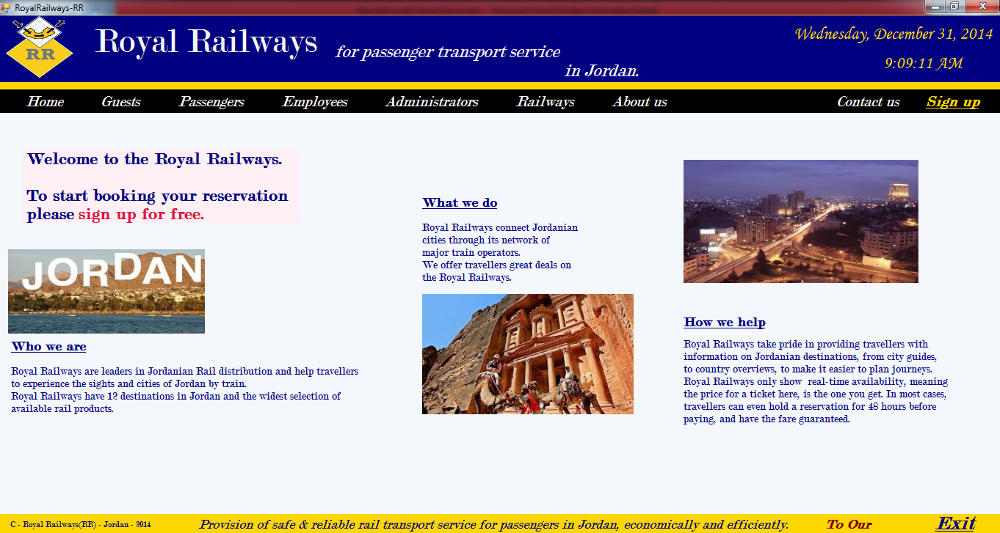

# Royal-Railways

## Overview

This system was built assuming that Jordan uses trains as public transportation in 12 main cities. The program allows users to view and book train trips to travel within the country. Users have options to schedule multiple trips in one ticket allowing them to choose between economy, business, and first-class seats.\
The program has a back-end access by employees of the train transportation company to input schedules of trains, modify existing trains or trips, enabling them to notify customers of updates, delays, and issues regarding their trips. Managers can manage employees’ access rights to the program to restrict access to the confidential employees information, accounting and managerial information.

## Getting Started
These instructions will get you a copy of the project up and running on your local machine for development and testing purposes. They will also give an overview of some of the app's functionality.

### Prerequisites
You will need Microsoft Visual studio installed if you want to run this application locally. For help installing Microsoft Visual studio, please [click here](https://visualstudio.microsoft.com/thank-you-downloading-visual-studio/?sku=community&rel=16).

### Installing
Git clone the repository to your local machine:

HTTPS:
```
https://github.com/AmjedAyoub/Royal-Railways.git
```
SSH:
```
git@github.com:AmjedAyoub/Royal-Railways.git
```
In the cloned repository, navigate to **"RRS"** folder, and open the ```"RRS.sln"``` file in your visual studio.

You will then be able to start the app locally by running:

```
Ctrl + F5
```

## Screenshots
### Home page


### Guest page

 
### Railway maps page

  
### About us page

 
### Contact us page

 
### Signup page

 
### Signin page

 
### Passenger View Trips page

 
### Passenger Book Trips page

 
### Passenger Confirm Trips page

 
### Employee & Admin View Trips page

 
### Employee & Admin Add Trips page

 
### Employee & Admin Cancel Trips page

 
### Employee & Admin Confirm Trips page

 
### Employee & Admin Add Train page

 
### Employee & Admin Delete Train page

 
### Admin Add Employee page

 
### Admin Delete Employee page


## Technologies & Tools
* C# programming language  
* MYSQL - MySQL Database
* Microsoft Visual Studio 2015

## Links
This program is published on [GitHub](https://github.com/AmjedAyoub/Royal-Railways).

## Planned updates
At the moment, this app is the minimum viable product. For future updates; improve the UI/UX, and add more functionality and features such as building a mobile responsive application.